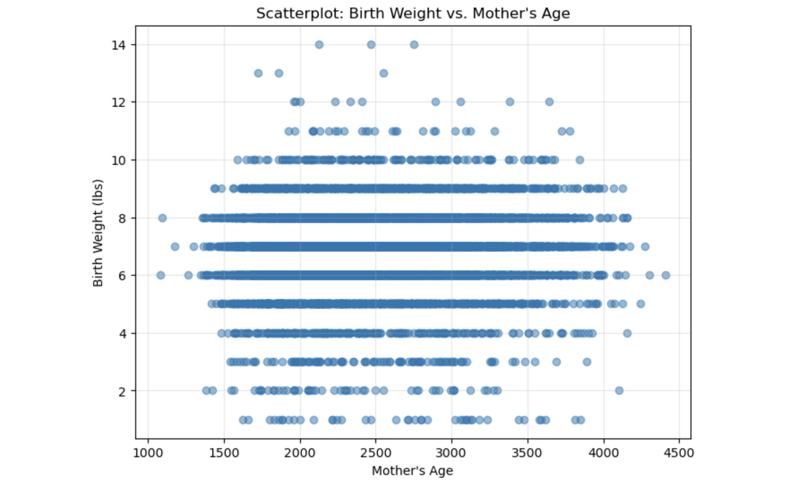
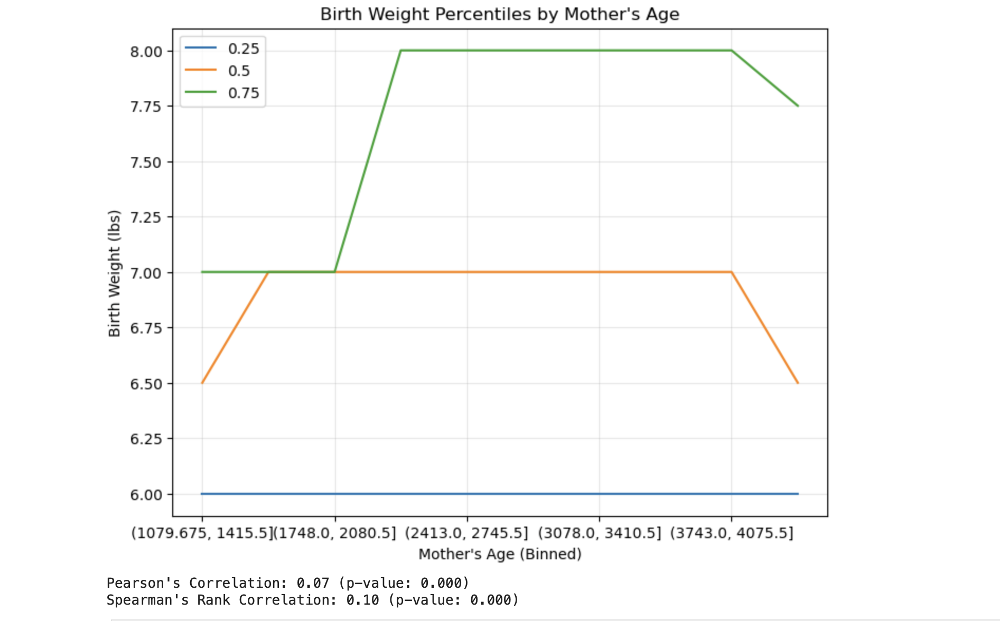
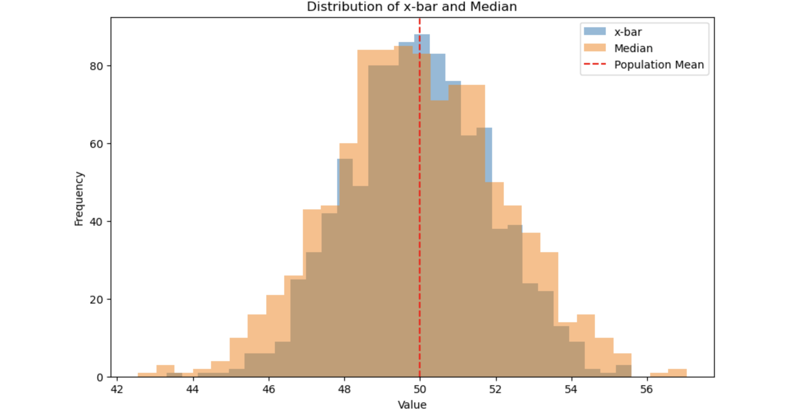
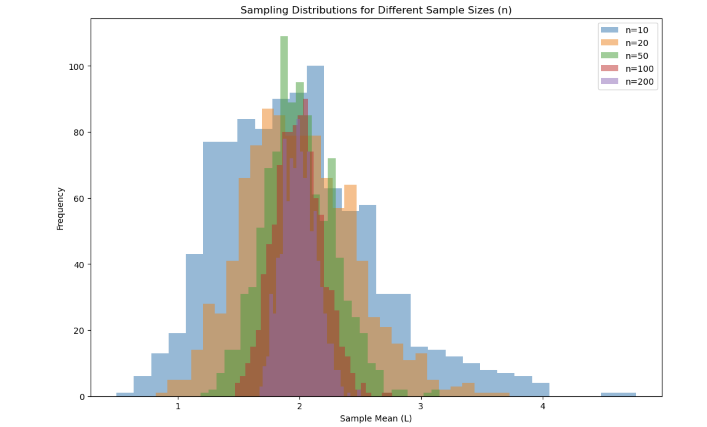
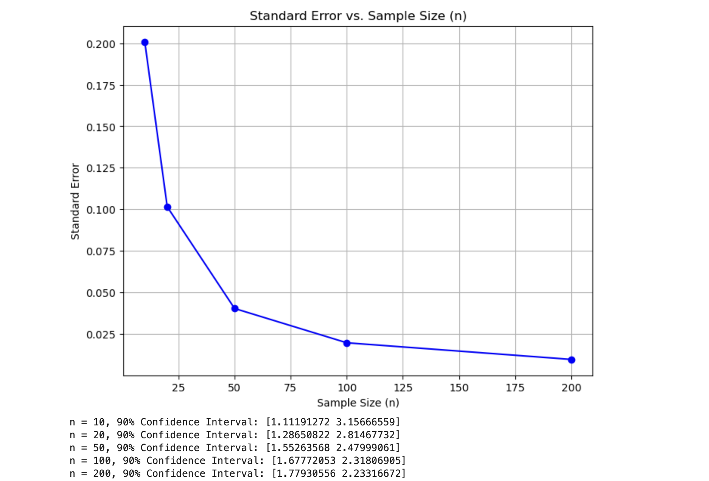

# PregnancyAnalyticsAI – Maternal Age, Birth Weight & Statistical Inference Analysis

## Project Purpose

This project analyzes pregnancy outcome data from the National Survey of Family Growth (NSFG) to explore the relationship between maternal age and infant birth weight while demonstrating key statistical concepts including sampling distributions, confidence intervals, correlation analysis, and inferential statistics.

The objective was to apply real-world healthcare data to investigate pregnancy trends and evaluate whether maternal age serves as a meaningful predictor of birth outcomes.

---

# Project Overview

Pregnancy outcomes are influenced by numerous biological, environmental, and socioeconomic factors. Maternal age is frequently examined within public health research due to its potential association with birth outcomes.

This project explores:

* Maternal age trends
* Birth weight distributions
* Correlation analysis
* Sampling theory
* Confidence interval estimation
* Statistical inference
* Population parameter estimation

The project serves as both a healthcare analytics study and a demonstration of foundational statistical methodologies used in data science.

---

# Dataset

**Source:** National Survey of Family Growth (NSFG) 2002

The dataset contains pregnancy-related observations including:

* Maternal Age
* Birth Weight
* Pregnancy Length
* Pregnancy Outcome
* Demographic Variables
* Population Statistics

The data was cleaned and prepared for exploratory and inferential statistical analysis.

---

# Methodology

## Data Preparation

* Imported pregnancy survey dataset
* Removed invalid observations
* Verified variable distributions
* Prepared numerical variables for statistical analysis

---

## Exploratory Data Analysis (EDA)

Performed:

* Summary statistics
* Distribution analysis
* Correlation analysis
* Scatterplot visualization
* Percentile analysis

---

## Statistical Inference

Applied:

* Random sampling
* Sample mean calculations
* Sample median calculations
* Confidence intervals
* Standard error estimation

---

## Simulation Analysis

Generated sampling distributions across multiple sample sizes:

* n = 10
* n = 20
* n = 50
* n = 100
* n = 200

to demonstrate the effects of sample size on estimate reliability and precision.

---

# Thought Process

The primary research question was:

> Does maternal age significantly influence infant birth weight?

Additional questions included:

* How strong is the relationship between maternal age and birth weight?
* How reliable are sample estimates?
* How does sample size impact statistical precision?
* What role does the Central Limit Theorem play in healthcare data analysis?

This project demonstrates how healthcare data can be transformed into statistically meaningful insights through exploratory analysis and inferential methods.

---

# Visual Analysis

## Primary Project Visualization

### Maternal Age vs Birth Weight Relationship



**File:** `PregnancyAnalyticsAI.png`

This scatterplot examines the relationship between maternal age and infant birth weight.

Key observations:

* Birth weights remain relatively stable across maternal age groups.
* No strong linear relationship is immediately visible.
* Significant variability exists within all age categories.

---

## Birth Weight Percentiles by Maternal Age



**File:** `birth_weight_percentiles_by_mother_age.png`

This visualization compares:

* 25th Percentile
* Median Birth Weight
* 75th Percentile

across maternal age ranges.

The results indicate relatively stable birth weight distributions despite increasing maternal age.

---

## Distribution of Sample Means and Medians



**File:** `distribution_of_xbar_and_median.png`

This histogram compares:

* Sample Means (x̄)
* Sample Medians

against the population mean.

The results demonstrate how repeated sampling produces estimates centered around the true population value.

---

## Sampling Distributions Across Sample Sizes



**File:** `sampling_distributions_by_sample_size.png`

This visualization demonstrates how sampling distributions become increasingly concentrated as sample size increases.

Sample sizes evaluated:

* n = 10
* n = 20
* n = 50
* n = 100
* n = 200

This serves as a practical demonstration of the Central Limit Theorem.

---

## Standard Error vs Sample Size



**File:** `standard_error_vs_sample_size.png`

The graph illustrates how standard error decreases as sample size increases.

Key insights:

* Larger samples produce more precise estimates.
* Confidence intervals become narrower.
* Statistical reliability improves.

---

# Key Findings

## Correlation Analysis

Pearson Correlation:

* r = 0.07

Spearman Rank Correlation:

* ρ = 0.10

Both metrics indicate a weak positive relationship between maternal age and birth weight.

---

## Sampling Results

The simulations demonstrated:

* Sample means converge toward the population mean.
* Larger sample sizes reduce variability.
* Standard error decreases as sample size increases.
* Confidence intervals become more precise.

---

## Statistical Conclusions

The analysis suggests:

* Maternal age alone is not a strong predictor of birth weight.
* Birth weight variability is influenced by multiple additional factors.
* Statistical inference provides reliable population estimates.
* Larger samples improve estimate accuracy.

---

# Healthcare Impact

This project demonstrates practical applications of statistical analytics in healthcare and public health research.

Potential use cases include:

* Maternal health studies
* Public health analytics
* Birth outcome monitoring
* Population health research
* Epidemiological studies
* Healthcare forecasting
* Clinical decision support

---

# Skills Demonstrated

## Statistics

* Correlation Analysis
* Sampling Theory
* Confidence Intervals
* Statistical Inference
* Hypothesis Testing
* Central Limit Theorem

---

## Data Science

* Exploratory Data Analysis (EDA)
* Data Cleaning
* Statistical Visualization
* Trend Analysis
* Population Analytics

---

## Python

* Pandas
* NumPy
* Matplotlib
* SciPy
* Statistical Simulation

---

## Healthcare Analytics

* Maternal Health Analytics
* Birth Outcome Research
* Population Health Analysis
* Healthcare Data Interpretation

---

# Repository Structure

```text
PregnancyAnalyticsAI/
│
├── notebook/
│   └── PregnancyAnalyticsAI.ipynb
│
├── visuals/
│   ├── PregnancyAnalyticsAI.png
│   ├── birth_weight_percentiles_by_mother_age.png
│   ├── distribution_of_xbar_and_median.png
│   ├── sampling_distributions_by_sample_size.png
│   └── standard_error_vs_sample_size.png
│
├── data/
│   └── 2002FemPreg.dat.csv
│
├── docs/
├── README.md
├── requirements.txt
└── .gitignore
```

---

# Installation

Clone the repository:

```bash
git clone https://github.com/Dare215/PregnancyAnalyticsAI.git
```

Navigate into the project:

```bash
cd PregnancyAnalyticsAI
```

Install dependencies:

```bash
pip install -r requirements.txt
```

Launch Jupyter Notebook:

```bash
jupyter notebook
```

Open:

```text
notebook/PregnancyAnalyticsAI.ipynb
```

---

# Future Improvements

Potential future enhancements include:

* Predictive modeling for birth outcomes
* Logistic regression analysis
* Maternal risk classification
* Advanced healthcare dashboards
* Interactive Streamlit deployment
* Longitudinal pregnancy trend analysis
* Multi-year NSFG dataset integration

---

# Author

## Darious Brown

**PhD Candidate – Artificial Intelligence & Machine Learning**
**DBA Candidate**
**Data Scientist | Machine Learning Engineer | AI Researcher**

### Professional Profiles

GitHub: https://github.com/Dare215

LinkedIn: https://www.linkedin.com/in/dariousbrown

Portfolio: https://dare215.github.io/DariousBrown-Portfolio/

Email: [dariousbrown3@icloud.com](mailto:dariousbrown3@icloud.com)

### Areas of Expertise

* Artificial Intelligence
* Machine Learning
* Deep Learning
* Generative AI
* Natural Language Processing
* Computer Vision
* Predictive Analytics
* Data Science
* Financial Analytics
* Healthcare Analytics
* Manufacturing Analytics

---

# License

This project is intended for educational, research, and portfolio demonstration purposes.
